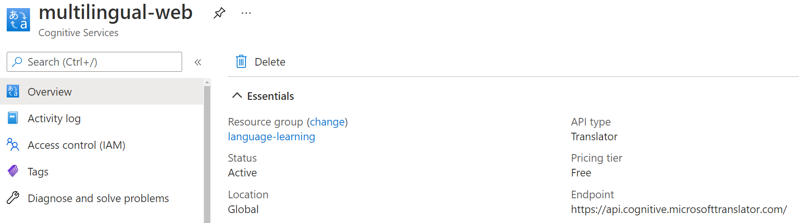
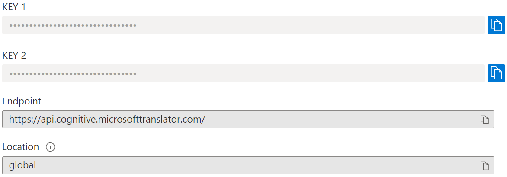

# Multilingual Web
Welcome to this little project of mine. Modern browsers are enhancing their automatic page translations with AI, which is awesome. But as someone who is learning other languages from time to time, I was missing the option to see the translation and the original at the same time. Especially the elemental structure of websites gave me the idea to build this extension:

> Use AI-based translators on webpages conveniently, but don't miss out on your multilingual skills!

## APIs used

External Translator: [Microsoft / Azure / Cognitive Services / Translator](https://docs.microsoft.com/en-us/azure/cognitive-services/translator/)

- a cloud-based machine translation service supporting multiple languages
- includes 2 million characters per month in the [free plan](https://azure.microsoft.com/en-us/pricing/details/cognitive-services/translator/) as well as a pay-as-you-go option for extensive use

Client used for HTTPRequests: [Axios](https://github.com/axios/axios)

- directly included in the package as `axios.min.js` (feel free to improve)

## Supported Browsers

- [Chrome](https://www.google.com/chrome/)
- [Edge](https://www.microsoft.com/en-us/edge)
- Other Chromium-based browsers like [Opera](https://www.opera.com/), [Brave](https://brave.com/) and [Vivaldi](https://vivaldi.com/) (untested)

## Get started

#### Install Extension (Sideloaded)

1. Download zip.
1. Go to chrome**://extensions/**, edge://extensions/ or similar.
1. Turn on **Developer mode**. You can find the toggle in one of the corners.
1. Click **Load unpacked**. Find and select the app or extension folder.

#### Activate Translator

Good AI-based translation is still mainly done by big companies, and usually comes with a cost. Microsoft's Translator is a great way to get free translations but needs some setup:

1. Create an [Azure free](https://azure.microsoft.com/en-us/free/) account (lasts 12 months).

2. Navigate to the [Azure Portal](https://ms.portal.azure.com/#home) home page.

3. Select **Create a resource** from the Azure services menu.

4. In the **Search the Marketplace** search box, enter and select **Translator** (single-service resource).

5. Select **Create** and you will be taken to the project details page.

6. [Complete your project and instance details](https://docs.microsoft.com/en-us/azure/cognitive-services/translator/translator-how-to-signup#complete-your-project-and-instance-details)

   Exemplary settings in Azure:

   

7. Select **Review + Create**. Then proceed to resource.

8. Find your key under **Resource Management - Keys and Endpoint**.

9. Click the blue icon to **copy KEY 1**.

   

10. Right-click the extension in the address bar and go to **Extension options**.

11. **Paste** the key and **save**.

Now you're ready to go!

## Disclaimer

This extension is not related to the [MultilingualWeb](https://www.multilingualweb.eu/) initiative or similar projects. It is solely made by Marlene Mayr to learn about browser extensions and aid in learning other languages.